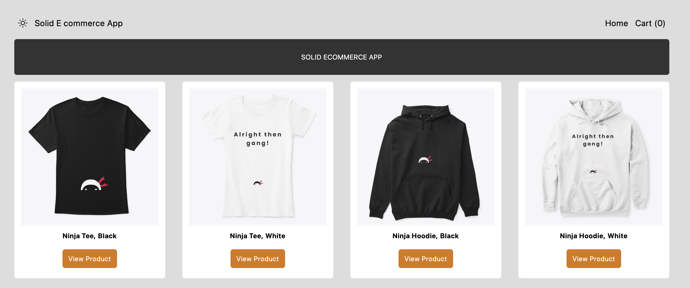
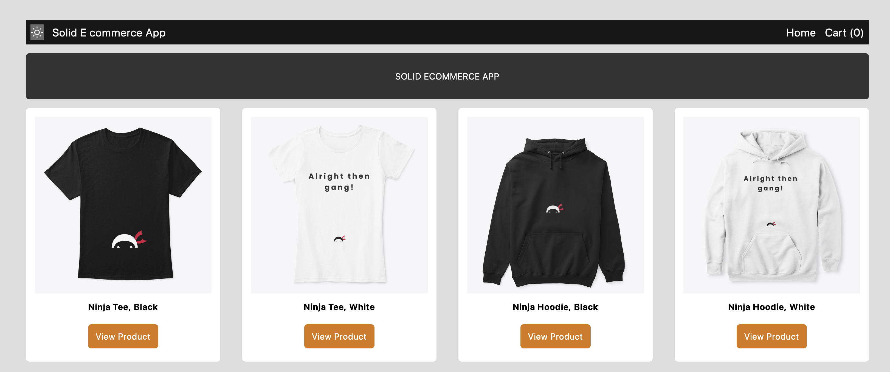
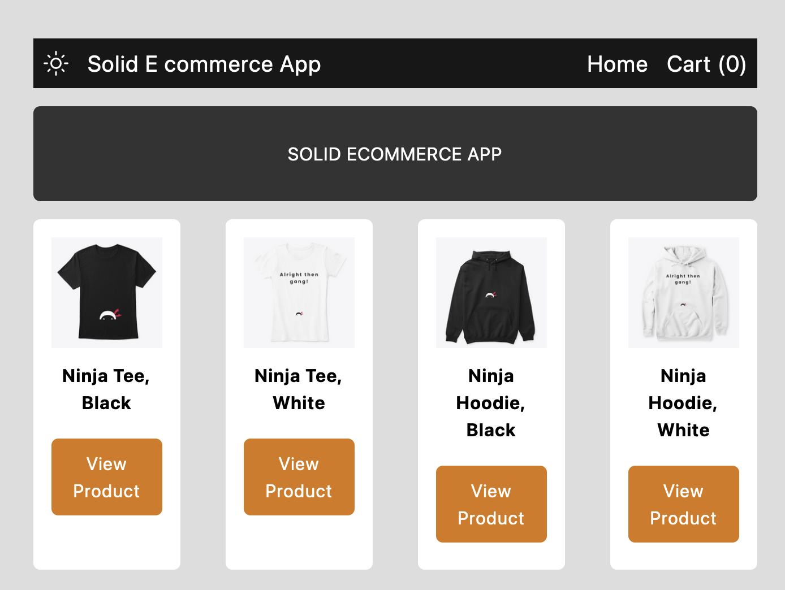
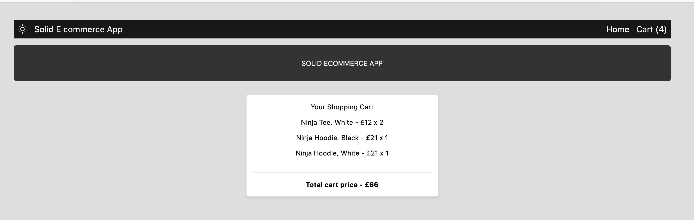

# Solid Cart APP

This is a simple cart app using solid.
Solid.js is a new front-end framework for creating web applications (like Vue, React, Svelte and others).
It's built up a lot of popularity in recent months amongs developers because It's quick, performant & really easy to use - especially if you have experience with React.
In this app i implement how Solid.js works & all the essentials you'll need to build reactive web applications with it.

💻 Screen Shoot💻

# Features:

1. Solid.js Basics (what is solid.js , making a solid.js app, components, Global styles & tailwind, props, signals,events handlers)
2. Adding the Solid Router (solid.js router, fetching data, conditional rendering, routes parameters)
3. Stores, Effects & Context (using store, effect, context, derrived values)
